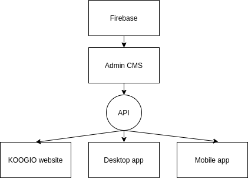

# About KOOGIO project

KOOGIO is an indie game studio. KOOGIO project is a collection of projects which are 
* Static website
* Web app
* Mobile app
* Desktop app 
* Api server 

to advertise KOOGIO. 

I created these projects to learn new things. Every tool I used was new to me when I built these projects.

These are some general tools I used for this project
* [Yarn workspaces](https://classic.yarnpkg.com/en/docs/workspaces/) manages Node dependency.
* [Github Actions](https://github.com/features/actions) manages workflows to build and deploy projects
* [Typescript](https://www.typescriptlang.org/) is the main language of this collection
* Markdown

This document save things I learned and tools I used when I built projects.

Diagram of the project

This document is created and deployed with these tools
* [Docsify](https://docsify.js.org/)
* [Github Pages](https://pages.github.com/)
